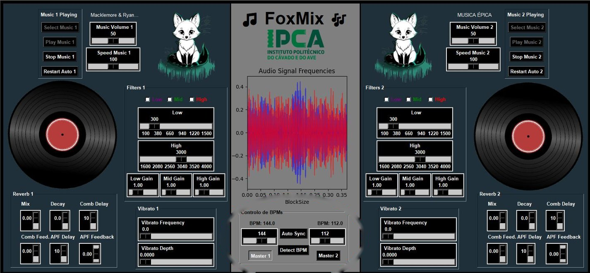
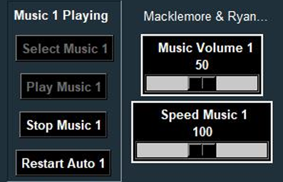
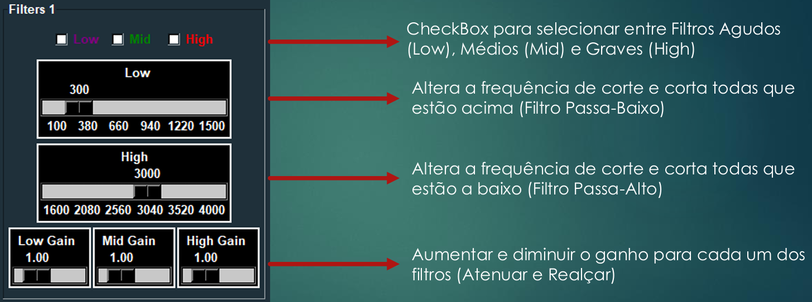
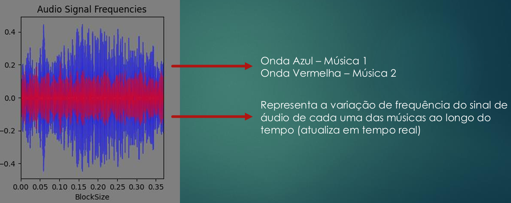
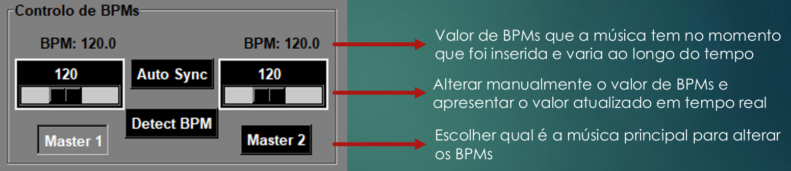
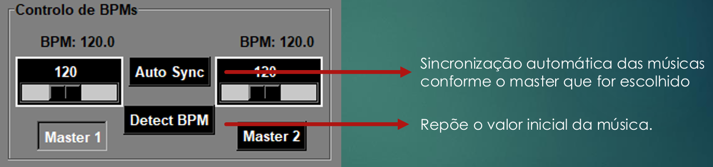
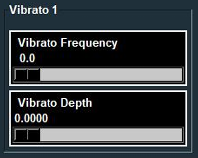
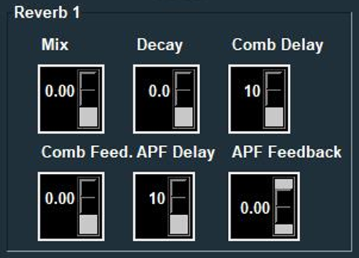
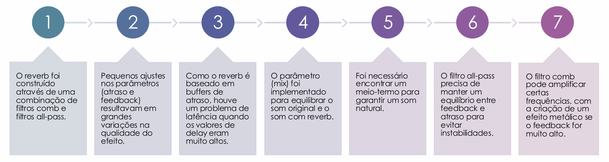

# 🎧 FoxMix — Mesa de Mistura Digital


<p align="center">
  
</p>

---

## 📋 Descrição

O **FoxMix** é uma mesa de mistura digital desenvolvida em Python com interface gráfica em Tkinter. Permite reproduzir e misturar duas músicas em simultâneo, com controlo em tempo real de filtros de áudio (graves, médios e agudos), visualização do espectro de frequências, sincronização de BPMs e efeitos de reverb e vibrato.

---

## 🎯 Funcionalidades

- **Dois decks independentes** — cada um com controlo de volume, velocidade, play/stop e restart
- **Filtros Butterworth de 4ª ordem** — passa-baixo (graves), passa-banda (médios) e passa-alto (agudos)
- **Visualização do espectro** em tempo real (onda azul = Música 1, onda vermelha = Música 2)
- **Controlo de BPMs** — deteção automática, ajuste manual e sincronização Auto Sync
- **Reverb** com filtros comb e all-pass configuráveis (Mix, Decay, Delay, Feedback)
- **Vibrato** com controlo de frequência e profundidade

---

## 🎵 Seletor de Músicas

<p align="center">
  
</p>

A aplicação tem **dois decks independentes** (Música 1 e Música 2), cada um com os seguintes controlos:

| Controlo | Função |
|---|---|
| **Select Music** | Abre um explorador de ficheiros para escolher um ficheiro de áudio |
| **Play Music** | Inicia a reprodução da música selecionada |
| **Stop Music** | Para a reprodução |
| **Restart Auto** | Reinicia automaticamente a música quando termina (loop) |
| **Music Volume** | Slider para ajustar o volume de 0 a 100 |
| **Speed Music** | Slider para ajustar a velocidade de reprodução (afeta também o BPM) |

O nome da música carregada é exibido no topo do deck. Os dois decks funcionam de forma completamente independente, permitindo misturar duas músicas em simultâneo.

---

## 🎛️ Filtros: Agudos, Médios e Graves

<p align="center">
  
</p>

O sistema de filtros permite ao utilizador selecionar e combinar três bandas de frequência:

| Filtro | Tipo | Frequências |
|---|---|---|
| **Low (Graves)** | Passa-Baixo | < 300 Hz (ajustável até 1500 Hz) |
| **Mid (Médios)** | Passa-Banda | 300 Hz – 3000 Hz |
| **High (Agudos)** | Passa-Alto | > 3000 Hz (ajustável até 4000 Hz) |

Os filtros são implementados com a biblioteca `scipy.signal` usando filtros **Butterworth de 4ª ordem**:

```python
list_low  = signal.butter(4, int(scale[index][0]), btype='lowpass',  fs=samplerate)
list_mid  = signal.butter(4, [int(scale[index][0]), int(scale[index][1])], btype='bandpass', fs=samplerate)
list_high = signal.butter(4, int(scale[index][1]), btype='highpass', fs=samplerate)
```

Cada filtro tem ainda um controlo de **ganho independente** (Low Gain, Mid Gain, High Gain) que permite atenuar ou realçar cada banda:

```python
if filters_enabled['low'][index]:
    data  = signal.filtfilt(filters['low'][0], filters['low'][1], data)
    data *= global_gains['low'][index]
```

---

## 📊 Espectro / Frequências do Sinal de Áudio

<p align="center">
  
</p>

O gráfico central da aplicação exibe o **espectro de frequências em tempo real** de ambas as músicas:

- 🔵 **Onda Azul** — Música 1
- 🔴 **Onda Vermelha** — Música 2

O gráfico é atualizado continuamente usando `FigureCanvasTkAgg` do Matplotlib integrado no Tkinter, representando a variação da amplitude do sinal ao longo do tempo (BlockSize).

---

## 🥁 Controlo de BPMs

<p align="center">
  
</p>

<p align="center">
  
</p>

O painel de BPMs oferece controlo total sobre o ritmo das músicas:

| Funcionalidade | Descrição |
|---|---|
| **BPM Display** | Valor de BPMs detetado automaticamente, atualizado em tempo real |
| **Slider manual** | Permite ajustar o BPM de cada música individualmente |
| **Detect BPM** | Deteção automática do BPM da música carregada |
| **Auto Sync** | Sincroniza automaticamente as duas músicas ao BPM do master |
| **Master 1 / Master 2** | Define qual é a música de referência para a sincronização |

---

## 🌊 Vibrato

<p align="center">
  
</p>

O **vibrato** é um efeito que cria uma variação periódica no pitch (altura) do som, dando uma sensação de "tremido" à música — semelhante ao efeito que um cantor cria ao oscilar a voz ligeiramente.

| Parâmetro | Função |
|---|---|
| **Vibrato Frequency** | Velocidade da oscilação do pitch (Hz) — quanto maior, mais rápido o tremido |
| **Vibrato Depth** | Intensidade da oscilação — quanto maior, mais pronunciado o efeito |

O efeito é implementado através de um **delay modulado sinusoidalmente**: o sinal de áudio é atrasado por uma quantidade que varia no tempo seguindo uma onda sinusoidal, o que causa a variação de pitch característica do vibrato.

```python
lfo = depth * np.sin(2 * np.pi * frequency * t)  # oscilador sinusoidal
delay_samples = int(abs(lfo) * samplerate)        # atraso variável
output[i] = buffer[(i - delay_samples) % len(buffer)]  # sinal atrasado
```

---

## 🔊 Reverb

<p align="center">
  
</p>

O **reverb** simula o efeito de reverberação de um espaço físico — como o eco que se ouve numa sala grande ou numa catedral. É construído através de uma combinação de **filtros Comb** e **filtros All-Pass**.

| Parâmetro | Função |
|---|---|
| **Mix** | Balanço entre o som original (seco) e o som com reverb (molhado) |
| **Decay** | Tempo que o eco demora a desaparecer — valores altos criam espaços maiores |
| **Comb Delay** | Atraso do filtro Comb em amostras — define o "tamanho" do espaço simulado |
| **Comb Feed.** | Feedback do filtro Comb — controla quanto do sinal é realimentado |
| **APF Delay** | Atraso do filtro All-Pass — difunde as reflexões para soar mais natural |
| **APF Feedback** | Feedback do filtro All-Pass — controla a intensidade da difusão |

**Como funciona:**

- O **filtro Comb** cria múltiplos ecos igualmente espaçados, simulando as primeiras reflexões de uma sala
- O **filtro All-Pass** difunde essas reflexões, tornando o som mais natural e menos metálico
- O parâmetro **Mix** combina o resultado com o sinal original

```python
# Filtro Comb: y[n] = x[n] + feedback * y[n - delay]
comb_out = input + comb_feedback * comb_buffer[delay]

# Filtro All-Pass: difunde as reflexões
apf_out = -apf_feedback * comb_out + apf_buffer[apf_delay] + apf_feedback * apf_out

# Mix final: combina seco + molhado
output = (1 - mix) * dry_signal + mix * apf_out
```

> ⚠️ **Nota:** Valores muito altos de Comb Feedback ou APF Feedback podem causar instabilidade e efeitos metálicos indesejados. Recomenda-se manter ambos abaixo de 0.9.

---

## ⚠️ Dificuldades Encontradas

<p align="center">
  
</p>

O maior desafio do projeto foi a implementação do **reverb**, que combina filtros comb e all-pass:

1. Construção do reverb com filtros comb + all-pass
2. Pequenos ajustes nos parâmetros causavam grandes variações na qualidade
3. Buffers de atraso elevados geravam problemas de latência
4. O parâmetro Mix foi essencial para equilibrar som original e processado
5. Necessidade de encontrar um equilíbrio para um som natural
6. O filtro all-pass requer balanço cuidado entre feedback e atraso
7. O filtro comb pode criar efeito metálico indesejado com feedback alto

---

## 🛠️ Tecnologias Utilizadas

<div align="center">

| Tecnologia | Utilização |
|---|---|
| **Python 3** | Linguagem principal |
| **Tkinter** | Interface gráfica (GUI) |
| **SciPy** | Filtros Butterworth (`signal.butter`, `signal.filtfilt`) |
| **Matplotlib** | Visualização do espectro de frequências |
| **Librosa** | Deteção de BPM e análise de áudio (`lb_display.waveshow`) |
| **PyCharm** | IDE de desenvolvimento |

</div>

---

## 🧩 Estrutura do Código

```
FoxMix/
├── main.py                ← Entrada da aplicação e interface Tkinter
├── filters.py             ← Filtros Butterworth (low, mid, high)
├── bpm.py                 ← Deteção e sincronização de BPMs
├── reverb.py              ← Efeito de reverb (comb + all-pass)
├── vibrato.py             ← Efeito de vibrato
└── graph.py               ← Visualização do espectro em tempo real
```

---

## 🏫 Instituição

**Instituto Politécnico do Cávado e do Ave (IPCA)**  
Escola Superior de Tecnologia  
Trabalho Prático — Processamento Digital de Sinal