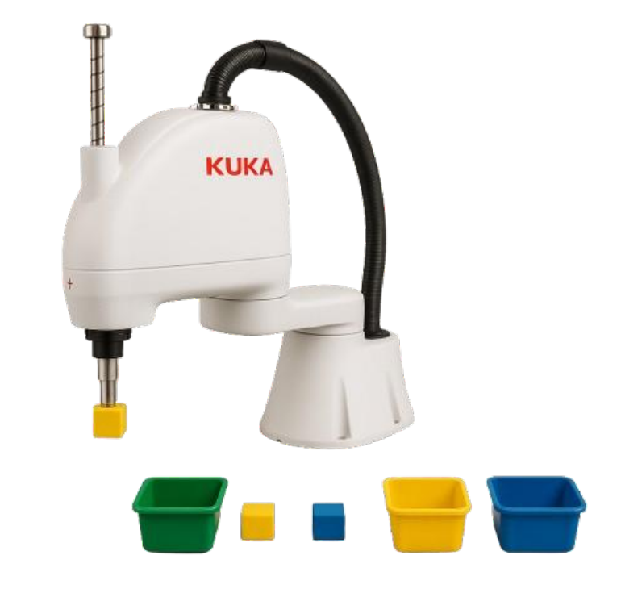
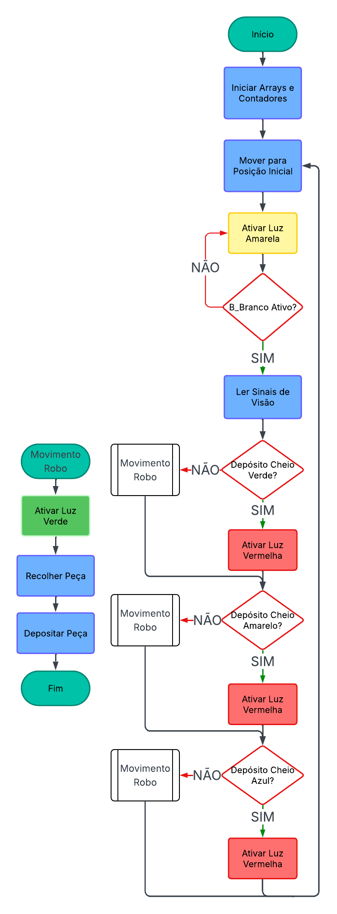
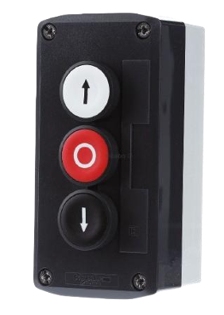
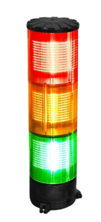
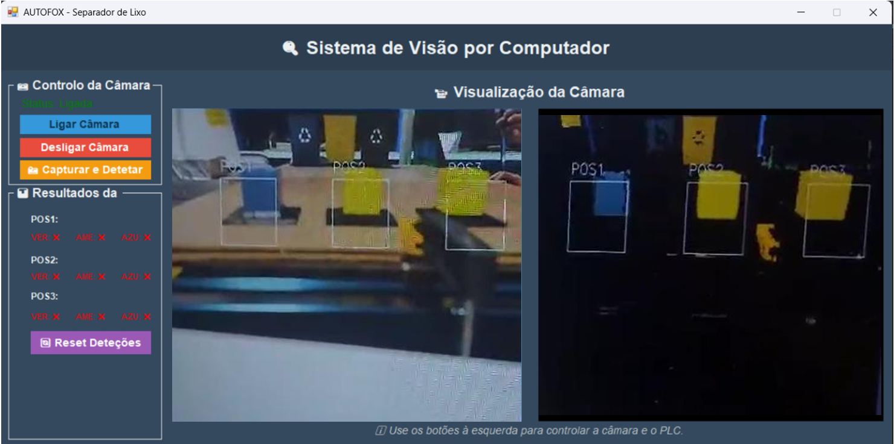
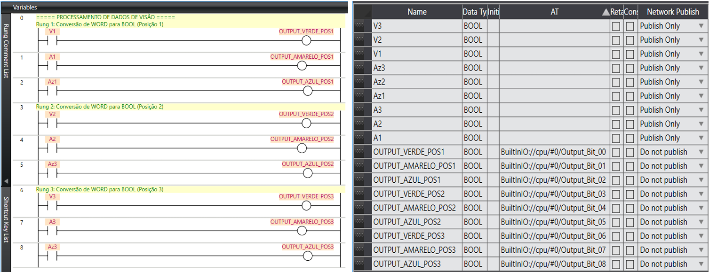

# 🤖 Robô Separador de Resíduos Recicláveis


<p align="center">
  
</p>

---

## 📋 Descrição

Sistema automatizado de separação de resíduos recicláveis que combina um **braço robótico KUKA SCARA**, **visão por computador** e um **controlador PLC Sysmac**. O robô identifica resíduos por cor (Verde, Amarelo, Azul) e deposita-os automaticamente no compartimento correto, sem intervenção humana.

---

## 🎯 Funcionalidades

- **Deteção automática de cor** via câmara e visão computacional em tempo real
- **Recolha e deposição** de peças em 3 posições distintas
- **Empilhamento progressivo** — o robô ajusta a altura de depósito a cada peça depositada (`offset = count × 25 mm`)
- **Sinais luminosos** de estado: 🟢 Operação | 🟡 Espera | 🔴 Erro
- **Interface gráfica** para monitorização em tempo real
- **Paragem de emergência e reset** com gestão por interrupções

---

## 🏗️ Arquitetura do Sistema

<div align="center">
  <pre>
┌─────────────────┐       ┌──────────────┐      ┌─────────────────┐
│   Câmara /      │────▶ │  PLC Sysmac  │────▶ │   Robô KUKA     │
│  Visão Computac.│       │  (Sysmac)    │      │   SCARA         │
└─────────────────┘       └──────────────┘      └─────────────────┘
│                      │                      │
      Deteta cor            Envia sinais         Recolhe e deposita
         da peça             digitais I/O        a peça no local certo
  </pre>
</div>

### Componentes principais

<div align="center">
  
  | Componente | Descrição |
  |---|---|
  | **Robô KUKA SCARA** | Braço robótico com garra (gripper) |
  | **Base_G3** | Sistema de coordenadas de referência da célula de trabalho |
  | **Tool_G3** | Definição do ponto exato de atuação da garra |
  | **SPTP** | Movimento suave ponto-a-ponto para deslocamentos rápidos |
  | **PLC Sysmac** | Controlador lógico que recebe dados da visão e comanda o robô |
  | **Aplicação de Visão** | Interface .NET com captura e classificação por cor |
</div>

---

## 🔄 Fluxo de Operação

<p align="center">
  
</p>

---

## 🎮 Interface de Controlo

O sistema inclui um painel físico com três botões e uma coluna de luzes de sinalização:

<p align="center">
  
  &nbsp;&nbsp;&nbsp;&nbsp;&nbsp;&nbsp;
  
</p>

<div align="center">
  
  | Botão | Função |
  |---|---|
  | ⬆️ Branco (B_Branco) | Start / Reativar ciclo |
  | 🔴 Vermelho (B_VERMELHO) | Paragem de emergência |
  | ⬇️ Preto (B_PRETO) | Reset geral |

  | Luz | Significado |
  |---|---|
  | 🟢 Verde | Operação normal — peça em processamento |
  | 🟡 Amarelo | Modo de espera |
  | 🔴 Vermelho | Erro — depósito cheio |
</div>

---

## 👁️ Aplicação de Visão por Computador

A aplicação captura imagens em tempo real, classifica os resíduos por cor e envia os resultados como sinais digitais booleanos para o PLC Sysmac, que por sua vez comanda o robô.

**Botões do painel:**
- `btnStartCamera` — Inicia a captura de vídeo
- `btnStopCamera` — Para a captura de vídeo
- `btnCapture` — Captura imagem, deteta cor/posição e envia para o PLC
- `btnResetDetections` — Limpa os resultados de deteção

<p align="center">
  
</p>

<p align="center">
  
</p>

---

## 📍 Pontos Definidos

### Pontos de Recolha
<div align="center">

  | Ponto | X | Y | Z | C |
  |---|---|---|---|---|
  | P1_Recolha | 65.5 | 224.0 | -140 | 26 |
  | P2_Recolha | 64.5 | 152.5 | -140 | 26 |
  | P3_Recolha | 63.5 | 82.0 | -140 | 26 |
</div>

### Pontos de Depósito
<div align="center">

  | Ponto | Cor | X | Y | Z | C |
  |---|---|---|---|---|---|
  | P1_Deposito | 🟢 Verde | 696.5 | 228.3 | -140 | 3.5 |
  | P2_Deposito | 🟡 Amarelo | 695.5 | 141.5 | -140 | 3.5 |
  | P3_Deposito | 🔵 Azul | 695.5 | 55.0 | -140 | 3.5 |
</div>

---

## 🔌 Mapeamento de I/O (KUKA ↔ Sysmac)
<div align="center">

  | Endereço KUKA | Sinal Sysmac | Função |
  |---|---|---|
  | IN11 | Output 00 | IN_POS1_VERDE |
  | IN12 | Output 01 | IN_POS1_AMARELO |
  | IN13 | Output 02 | IN_POS1_AZUL |
  | IN14 | Output 03 | IN_POS2_AZUL |
  | IN15 | Output 04 | IN_POS2_AMARELO |
  | IN16 | Output 05 | IN_POS2_AZUL |
  | IN17 | Output 06 | IN_POS3_VERDE |
  | IN18 | Output 07 | IN_POS3_AMARELO |
  | IN19 | Output 08 | IN_POS3_AZUL |
  | IN20 | Botão Branco | B_Branco (Start) |
  | IN21 | Botão Vermelho | B_VERMELHO (Stop) |
  | IN22 | Botão Preto | B_PRETO (Reset) |
  | OUT21 | — | Luz Azul |
  | OUT22 | — | Luz Verde |
  | OUT23 | — | Luz Laranja |
</div>

---

## 🧩 Estrutura do Programa (KRL)

```
robotic()                  ← Ciclo principal
├── Inicializacao()        ← Configura arrays de pontos
├── leitura_visao()        ← Lê sinais da câmara e decide ação
│   ├── Recolher(P, inter) ← Move, desce, agarra, sobe, regressa a HOME
│   └── Deposito(P, count) ← Move, desce com offset, larga, sobe, regressa
├── Parar_Robo()           ← Interrupção de paragem (B_VERMELHO)
└── Reset_Robo()           ← Interrupção de reset (B_PRETO)
```

---

## 🚀 Melhorias Futuras

- [ ] Sensores de fim de curso no depósito para confirmar deposição
- [ ] Deteção avançada por forma e dimensão (não apenas cor)
- [ ] Otimização de trajetórias para reduzir tempo de ciclo
- [ ] Dashboard de monitorização remota com histórico de peças processadas

---

## 👨‍💻 Autores

| Nome | Número |
|---|---|
| Bruno Rodrigues | N.º 31015 |
| Pedro Rego | N.º 14905 |

**Orientador:** Professor Joni Santos  
**Data:** Julho de 2025

---

## 🏫 Instituição

**Instituto Politécnico do Cávado e do Ave (IPCA)**  
Escola Superior de Tecnologia  
Mestrado em Engenharia Eletrotécnica e de Computadores
