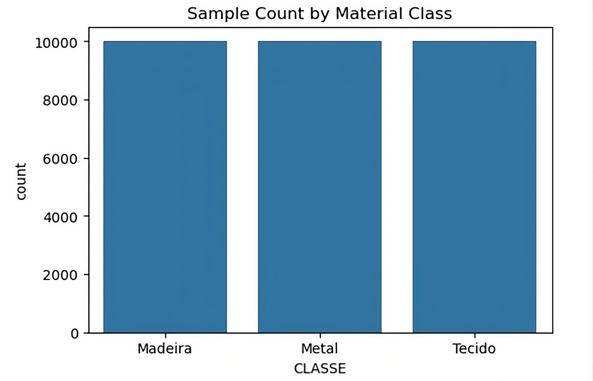
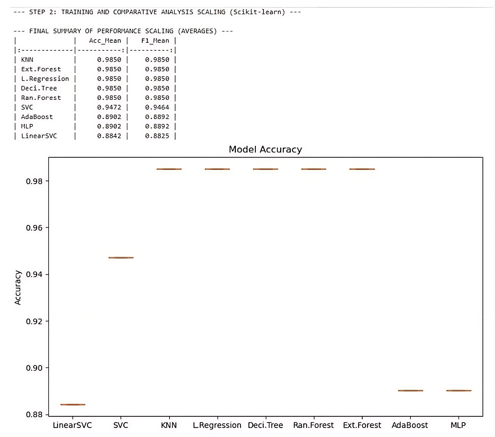
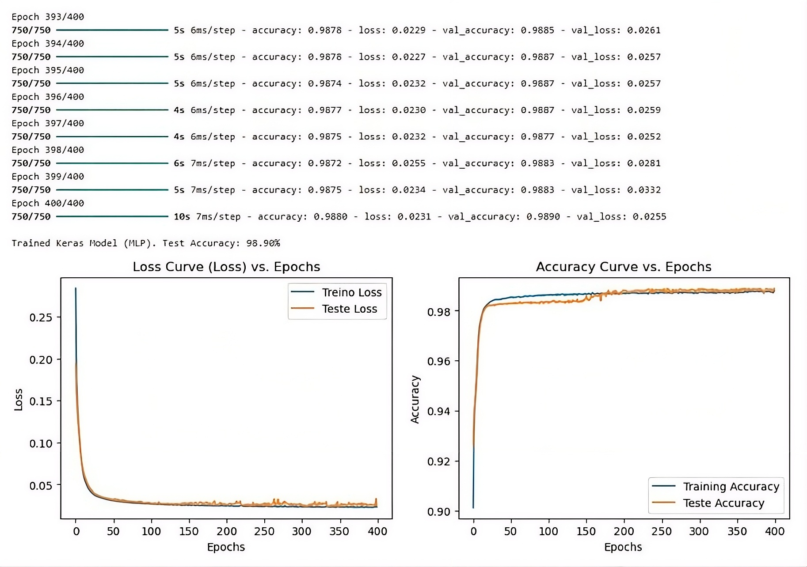
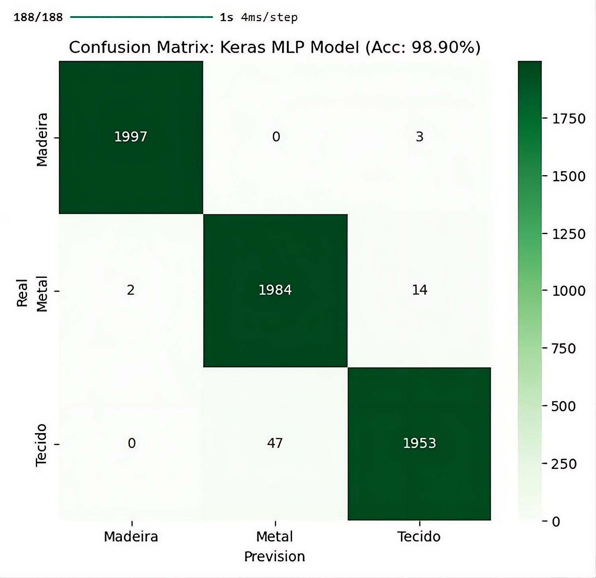

# 🔬 Classificação de Materiais via TinyML — Fusão de Dados


## 📋 Descrição do Projeto

Este projeto implementa um **sistema ciberfísico** para a classificação autónoma de três materiais — **Madeira**, **Metal** e **Tecido** — no contexto da Indústria 4.0. A abordagem central é a **Fusão Sensorial (Sensor Fusion)**, que combina dados de múltiplos sensores heterogéneos para superar as limitações dos sistemas unimodais (como a visão por computador).

O sistema integra um microcontrolador **ESP32** em modo *Edge Computing*, responsável pela aquisição e pré-processamento de dados, com um modelo de *Machine Learning* (**MLP — Multilayer Perceptron**) exportado para **TensorFlow Lite** para inferência em tempo real diretamente no dispositivo.

---

## 🏗️ Arquitetura do Sistema

O vetor de características é construído a partir de três domínios físicos distintos:

| Variável | Sensor | Domínio Físico | Objetivo |
|---|---|---|---|
| **Cor (H, S, V)** | Sensor de Cor (Luz-Frequência) | Ótico | Distinguir materiais pela cor, com robustez a variações de iluminação |
| **Vibração (Vib)** | Acelerómetro MEMS Triaxial (MMA8452) | Cinético/Tribológico | Quantificar rugosidade e textura superficial |
| **Metalicidade (Metal)** | Sensor Indutivo (ADC) | Eletromagnético | Detetar presença/ausência de condutividade elétrica |

---

## ⚙️ Firmware e Processamento de Sinal (DSP)

O firmware foi desenvolvido em **C++** no ambiente Arduino (ESP-IDF), com uma arquitetura modular orientada a objetos. Implementa uma **Máquina de Estados Finitos (FSM)** com dois modos:

- **`S_Idle`** — Web Server ativo para monitorização e calibração dos sensores via REST API / AJAX.
- **`S_Acq`** — Web Server desativado (Wi-Fi desligado) para aquisição de alta velocidade com *timing* determinístico.

### Processamento por sensor

**Cor (HSV):** Filtro de Média Móvel (MA Filter, N=8 amostras) sobre o sinal do sensor Luz-Frequência, seguido de conversão RGB → HSV para dissociar a cromaticidade da luminância.

**Vibração:** Filtro Passa-Alto (HPF) digital de 1ª ordem (IIR, α=0.95) para remover a componente DC da gravidade, seguido de cálculo da magnitude vetorial e Filtro de Envelope (k=0.2).

**Metalicidade:** Inversão lógica e normalização ADC: `Valor Normalizado = |4095 − Leitura Bruta|`.

---

## 📡 Telemetria e Construção do Dataset

A comunicação entre o PC (Python) e o ESP32 usa **UART a 115200 baud**, com um protocolo Comando-Resposta. Os dados são prefixados com o caractere `?` como delimitador de pacote.

Como as features não podem ser adquiridas simultaneamente (vibração exige movimento; cor exige estabilidade), foi implementada uma estratégia de **Construção Incremental Esparsa-Densa**:

1. **Fase 1 (HSV):** Criação da estrutura tabular com colunas de cor preenchidas; colunas de vibração/metal vazias.
2. **Fase 2 (VIB/METAL):** Leitura-Modificação-Escrita do CSV em memória RAM para densificação sequencial das células vazias.

Para garantir o balanceamento, foi aplicado um limite de **500 amostras por classe** (`MAX_LINHAS = 500`) durante a aquisição.

---

## 📊 Dataset e Engenharia de Dados

O dataset final consolidou **30.000 amostras** (10.000 por classe), distribuídas de forma perfeitamente equilibrada:

<p align="center">
  
</p>

A feature **Metal** foi removida após análise de variância, por apresentar desvio padrão ≈ 0 (constante), o que colapsa o StandardScaler. O conjunto final de features válidas é:

```
X_Final = { Hue, Saturation, Value, Vibration }
```

Os dados foram divididos em **80% treino (~24.000 amostras)** e **20% teste (~6.000 amostras)**, com `stratify=y` para manter a proporção 1:1:1 entre classes.

A normalização aplicada foi **Z-Score**:

```
z = (x − μ) / σ
```

---

## 🤖 Treino e Comparação de Modelos (Scikit-Learn)

Foram comparados vários algoritmos de Machine Learning (média de 5 execuções independentes):

<p align="center">
  
</p>

Os modelos com capacidade de modelar relações não-lineares — **SVC (Kernel RBF)** e **MLP** — obtiveram o melhor desempenho (~98.5%). O **MLP em TensorFlow/Keras** foi escolhido para produção pelas seguintes razões:

- **Pipeline TFLite otimizado** — exportação automática para formato binário com quantização Float16, reduzindo o modelo para ~50% do tamanho original sem perda significativa de accuracy.
- **Portabilidade** — conversão direta Keras → TFLite → C-Array (`model_data.h`), pronto para o ESP32.
- **Escalabilidade** — fácil adição de novas features ou classes.

---

## 🧠 Modelo Final — MLP (Keras / TensorFlow Lite)

### Arquitetura

```
Input (4) → Dense 128 (ReLU) → Dense 64 (ReLU) → Output 3 (Softmax)
```

### Configuração de Treino

| Parâmetro | Valor | Justificação |
|---|---|---|
| Otimizador | Adam | Robusto para datasets grandes |
| Taxa de Aprendizagem | 0.0005 | Convergência estável com 30K amostras |
| Epochs | 400 | Convergência total com LR reduzida |

### Curvas de Convergência

<p align="center">
  
</p>

As curvas de treino e teste evoluem em paralelo, confirmando **ausência de overfitting**.

### Resultado Final

<p align="center">
  
</p>

**Accuracy no conjunto de teste: 98.90%**

---

## 📦 Exportação TinyML (TFLite)

O modelo treinado é exportado para o ESP32 em dois ficheiros de cabeçalho C:

- **`model_data.h`** — modelo serializado como `const unsigned char g_model[]`, armazenado na memória Flash (PROGMEM), libertando a RAM do microcontrolador.
- **`scaler_parameters.h`** — vetores `SCALER_MEAN` (μ) e `SCALER_STD` (σ) para replicar exatamente a normalização Z-Score no Edge antes de cada inferência.

### Pipeline de Inferência em Tempo Real

```
Leitura Sensores → Normalização Z-Score (scaler_parameters.h) 
→ TFLite Runtime → Classe Prevista (Madeira / Metal / Tecido)
```

A função `runInference()` pode ser ativada remotamente via rota HTTP `/classify` no Web Server do ESP32.

---

## ✅ Conclusões

- A **fusão de features HSV + Vibração** provou ser fundamental para superar as limitações de sensores individuais, atingindo **98.90% de accuracy**.
- A **Engenharia de Características no Edge** (conversão RGB→HSV e HPF no microcontrolador) garante features robustas antes da classificação.
- A abordagem **TinyML** permite inferência local no ESP32, eliminando dependência de conectividade e reduzindo latência.

### Trabalhos Futuros

1. **Integração completa do sensor indutivo** — nova fase de treino com a feature Metal funcional.
2. **Otimização de energia** — modo Deep Sleep entre classificações.
3. **Expansão do dataset** — novas classes de materiais (Plástico, Cerâmica).

---

## 👨‍💻 Autores

| Nome | Número |
|---|---|
| Bruno Rodrigues | N.º 31015 |
| Pedro Rego | N.º 14905 |

**Orientador:** Professor José Brito  
**Data:** dezembro de 2025

---

## 🏫 Instituição

**Instituto Politécnico do Cávado e do Ave (IPCA)**  
Escola Superior de Tecnologia  
Mestrado em Engenharia Eletrotécnica e de Computadores
